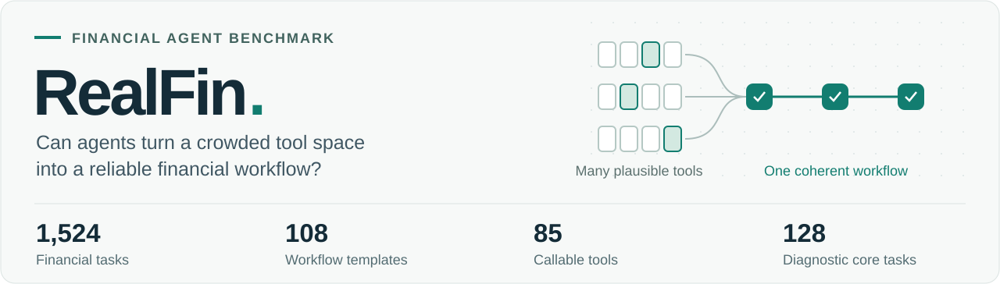
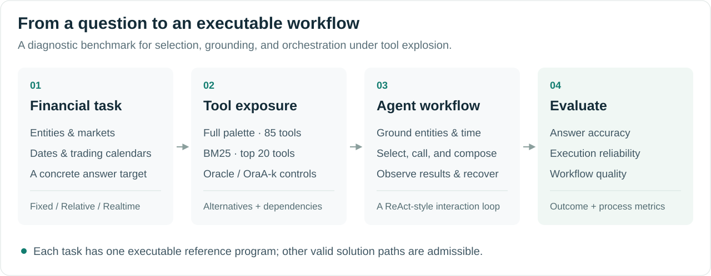

<p align="center">
  
</p>

<p align="center">
  <strong>Benchmarking Agent Skills for Multi-Tool Orchestration<br>under Tool Explosion</strong>
</p>

<p align="center">
  Ying Huang · Shuoling Liu · Liyuan Chen · Jie Shi · Jiaqing Liang · Yang Pengtao<br>
  Ying Liao · Jinyi Han · Sihang Jiang · Yanghua Xiao
</p>

<p align="center">
  <sub>Fudan University &nbsp; · &nbsp; E Fund Management &nbsp; · &nbsp; East China Normal University</sub>
</p>

<p align="center">
  <a href="docs/paper/realfin.pdf"><strong>Paper</strong></a> &nbsp; / &nbsp;
  <a href="docs/data.md"><strong>Dataset</strong></a> &nbsp; / &nbsp;
  <a href="#quick-start"><strong>Quick start</strong></a> &nbsp; / &nbsp;
  <a href="#results"><strong>Results</strong></a> &nbsp; / &nbsp;
  <a href="#citation"><strong>Citation</strong></a>
</p>

---

## Overview

**Can an agent build a reliable workflow when many plausible financial tools are available?** RealFin is a finance-domain diagnostic benchmark for studying tool selection, temporal grounding, and multi-tool orchestration under tool explosion.

Each task pairs a Chinese financial question with an executable reference program over real market, macroeconomic, and company-data APIs. Tools overlap in function, depend on one another, and differ in temporal scope. Solving a task requires choosing tools, grounding entities and dates, and composing intermediate results into a coherent workflow.

- **Workflow-grounded tasks.** 1,524 instances from 108 author-designed templates, with executable reference programs.
- **A deliberately ambiguous tool space.** 85 tool definitions with alternative, dependency, and related-tool metadata.
- **Evaluation beyond the final answer.** The paper diagnoses selection, ordering, parameter planning, entity and temporal grounding, orchestration, and recovery.

<p align="center">
  
</p>

The reference program specifies **one verified solution path**. The paper's evaluation design admits semantically valid alternatives; it does not require every agent to reproduce the same API sequence.

## Dataset

| Resource | Size | Purpose |
| :--- | ---: | :--- |
| [RealFin](data/realfin_data.jsonl) | 1,524 tasks | Full benchmark for dataset analysis and evaluation |
| [RealFin-128](data/subset_128.jsonl) | 128 tasks | Diagnostic core used in the paper's main experiments |
| [Tool library](agent/tools/tool_library) | 85 definitions | Financial functions and structured tool metadata |

The benchmark spans **Snapshot, Compare, Aggregate, and Fundamentals** tasks, with **Fixed, Relative, and Realtime** temporal regimes. The diagnostic core intentionally oversamples Compare and Realtime cases; its results should be interpreted within that scope.

See the [data card](docs/data.md) for distributions, record fields, a worked example, and an offline inspection command.

## Results

**Correct answers can coexist with unreliable workflows.** Under Full exposure, orchestration success is only **0.0–0.8%** across all seven evaluated models, while answer accuracy reaches **33.6%**.

The following values are **reported in the [paper](docs/paper/realfin.pdf), on the 128-task diagnostic core**. All values are percentages; higher is better.

| Model | Full ACC | Full OSR | Pkg ACC | Pkg OSR |
| :--- | ---: | ---: | ---: | ---: |
| Claude 4.5 Sonnet | 9.4 | 0.0 | 23.4 | 17.2 |
| GPT-5.1 | 1.6 | 0.0 | 30.5 | 15.6 |
| Gemini 3 Pro | 8.6 | 0.0 | 38.3 | 12.5 |
| Qwen Max | 3.1 | 0.0 | 23.4 | 13.3 |
| DeepSeek V3.2 | 30.5 | 0.0 | 19.5 | 13.3 |
| Doubao Seed 1.6 | 33.6 | 0.8 | 42.2 | 11.7 |
| Kimi K2 | 10.2 | 0.8 | 14.1 | 2.3 |

**ACC** measures final-answer accuracy; **OSR** measures orchestration success. **Full** exposes all 85 tools in a ReAct-style harness. **Pkg** uses progressive disclosure through package routing and changes the harness. These are diagnostic comparisons, not a full-benchmark leaderboard.

The current runner records trajectories and answer scores. The paper's full process-metric evaluator and Pkg experiment entry point are not included in this checkout; see [reproduction scope](docs/reproduction.md#reproduction-scope).

## Quick start

### 1. Install

Use Python 3.11 or newer in a virtual environment. The dependency file describes the current source requirements; it is not a lockfile for the paper's experiments.

```bash
git clone https://github.com/TomatoHY/RealFin-Agent.git
cd RealFin-Agent
python -m venv .venv
source .venv/bin/activate
python -m pip install -r requirements.txt
cp .env.example .env
```

### 2. Configure an endpoint

Edit `.env` with credentials for an OpenAI-compatible endpoint you can access. For the `--location openai` configuration:

```dotenv
OPENAI_API_KEY=your-api-key
OPENAI_API_BASE=https://your-model-endpoint.example/v1
```

The endpoint must serve the model selected by `--model`. Model aliases and their request names are defined in [the model registry](agent/models/model_factory.py). A separate `realfin` configuration is available for users with access to that gateway; see [configuration details](docs/reproduction.md#model-and-api-configuration).

### 3. Run one task

```bash
python run_agent.py \
  --model gpt-5.1 \
  --location openai \
  --tool_filter_strategy full \
  --test_data_path data/subset_128.jsonl \
  --limit 1 \
  --output_path output/smoke
```

This invokes the configured model and may query live financial APIs. Records with `golden_result: "实时获取"` execute their reference program at run time. **`--limit 1` runs one task; `--limit 0` runs the entire selected file.**

Outputs are written to `output/smoke/`: `config.json`, `agent_log.log`, and `test_results.jsonl`. Each result contains the trajectory, extracted tool calls, final answer, and `eval_score`.

### 4. Compare tool exposure

| Setting | CLI arguments | Visible tools |
| :--- | :--- | :--- |
| Full | `--tool_filter_strategy full` | All 85 definitions |
| BM25 | `--tool_filter_strategy bm25` | Top 20 retrieved tools |
| Oracle | `--tool_filter_strategy oracle` | Tools directly referenced in the reference program |
| OraA-3 | `--tool_filter_strategy orac_k --k 3` | Oracle tools, annotated alternatives, and 3 random distractors |
| OraA-10 | `--tool_filter_strategy orac_k --k 10` | Oracle tools, annotated alternatives, and 10 random distractors |

See the [run guide](docs/reproduction.md) for diagnostic-core commands, output analysis, implementation details, and the remaining steps needed to reproduce the paper's full evaluation.

## Repository guide

```text
RealFin-Agent/
├── agent/
│   ├── realfin_agent.py       # LangGraph agent workflow
│   ├── models/               # Model aliases and client factory
│   ├── nodes/                # Tool selection, model calls, execution
│   ├── prompts/              # System and tool interaction prompts
│   ├── tools/                # Selectors and financial tool library
│   └── utils/                # Configuration and agent state
├── data/                     # Full benchmark and diagnostic core
├── docs/                     # Data card, run guide, figures, paper
├── tests/                    # Offline runner regression checks
├── .env.example              # API configuration template
├── requirements.txt          # Runtime dependencies
└── run_agent.py               # Evaluation entry point
```

## Citation

If you use RealFin in your research, please cite the accompanying manuscript:

```bibtex
@unpublished{huang_realfin,
  title  = {{RealFin}: Benchmarking Agent Skills for Multi-Tool Orchestration under Tool Explosion},
  author = {Ying Huang and Shuoling Liu and Liyuan Chen and Jie Shi and
            Jiaqing Liang and {Yang Pengtao} and Ying Liao and Jinyi Han and
            Sihang Jiang and Yanghua Xiao},
  note   = {Manuscript},
  url    = {https://github.com/TomatoHY/RealFin-Agent}
}
```

## License

The code is released under [Apache License 2.0](LICENSE). Financial tools access external data providers; their data remains subject to the respective providers' terms.
